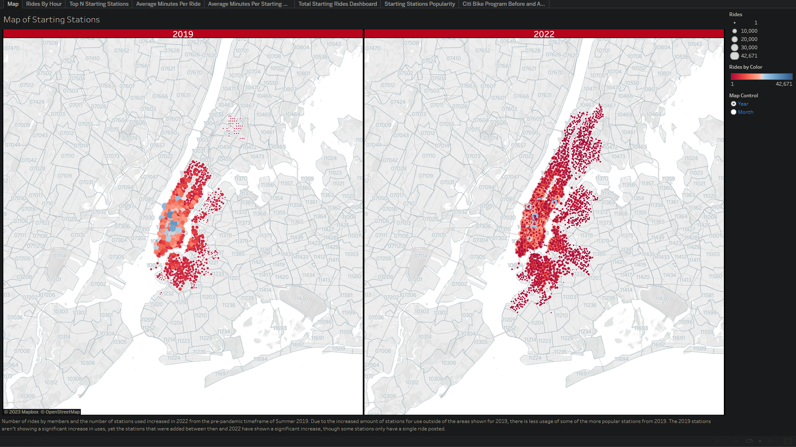
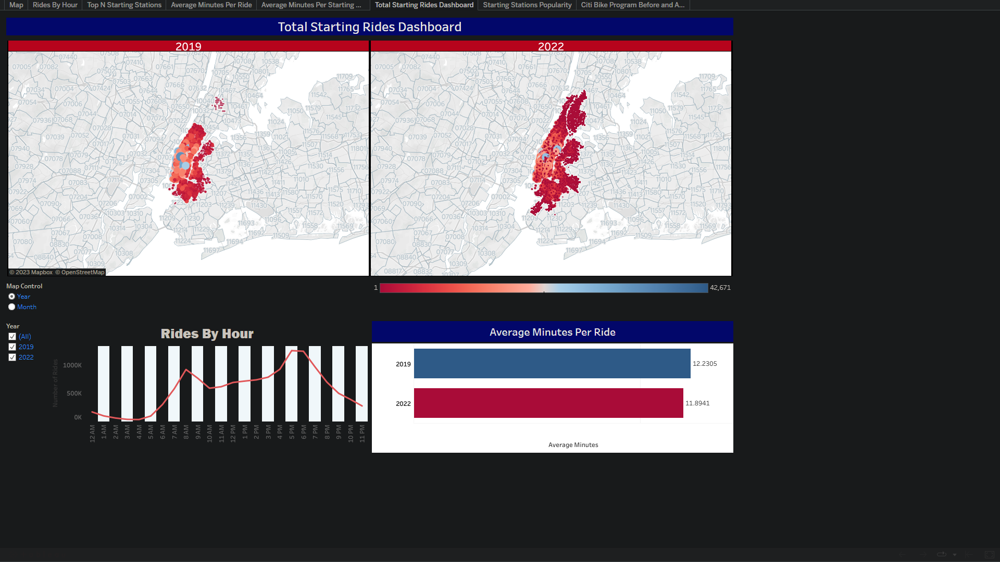
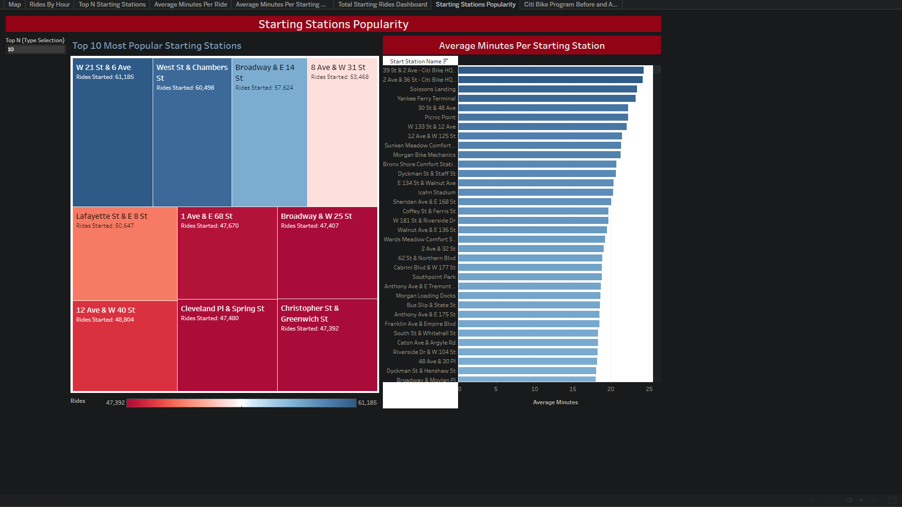

# Citi Bike Program Dashboards

This is an assignment for the University of Minnesota Data Analytics and Visualization Boot Camp.

Tableau Public Link: https://public.tableau.com/views/CitiBikeDashboard_16761623244900/CitiBikeProgramBeforeandAfterCOVID-19?:language=en-US&:display_count=n&:origin=viz_share_link

## Background
Congratulations on your new job! As the new lead analyst for the New York Citi Bike Links to an external site.program, you are now responsible for overseeing the largest bike-sharing program in the United States. In your new role, you will be expected to generate regular reports for city officials looking to publicize and improve the city program.

Since 2013, the Citi Bike program has implemented a robust infrastructure for collecting data on the program's utilization. Each month, bike data is collected, organized, and made public on the Citi Bike Data Links to an external webpage.

However, while the data has been regularly updated, the team has yet to implement a dashboard or sophisticated reporting process. City officials have questions about the program, so your first task on the job is to build a set of data reports to provide the answers.
 
# Chosen Scope and Limitations
This assignment allowed room for creativity in how we choose to represent the datasets provided. Since Tableau has a limit of how much data it will take in, I decided to compare the months of June, July, and August for both 2019 and 2022 to see if the COVID-19 pandemic impacted any participation in the program. Ideally, I would have preferred to have used the entire period of 2019-2022. However, even just using those 6 months' datasets, the row total almost came to Tableau's maximum.

I also chose to focus on starting stations when discussing and showing bike stations in order to keep things consistent.

## Tools Used
- Python/Pandas
- Tableau
 
# Data Cleaning
Since Tableau can only take datasets of up to 15,000,000 rows, data needed to be cleaned and combined in Python in order to fit appropraitely into Tableau. For this reason, the six CSV files pulled from Citi Bike trip data (https://citibikenyc.com/system-data) were brought into Pandas to downsize to data for members only. Since 2019 and 2022 datasets had different pieces of information, the 2019 files were transformed to fit the parameters of the 2022 datasets. From there, the combined dataset was exported to a CSV file to pull into Tableau.

Once in Tableau, there was another major calculation that needed to be performed (that probably should have been done in Python). A column for Ride Duration needed to be made by finding the difference in start time and end time in seconds, converting it into minutes and hours, and recombining. Ultimately, though, I ended up only using the minutes columns from this calculation sequence because it was the most relevant.
 
# Map

One of the requirements of this assignment was a map showing bike stations. The map I created has a Map Control to choose to display a side-by-side map of 2019 and 2022 as a whole or a map showing the breakdown of each month side-by-side. The map shows all of the starting stations with markers that have differing sizes and colors to show how many rides were started at that station. The assignment required that the map display zip codes as well, though I would have preferred the regular street map to show the area better.

Using the maps, we can see that the Citi Bike Program grew significantly between 2019 and 2022. More stations are available and being used, resulting in a larger field of riders. However, due to the expansion, there are less rides being reported at some of the more popular stations.
 
# Dashboards
## Dashboard 1
Two dashboards were created in Tableau. The first dashboard, Total Starting Rides Dashboard, shows the map mentioned above as well as two additional charts. The Rides By Hour chart displays the number of total rides broke down by hour of day. The Average Minutes Per Ride chart shows the average minutes per ride. This chart is connected to the Map Control for Year and Month, so it changes when the map does to display a breakdown by Month/Year rather than just Year.

 
## Dashboard 2
The second dashboard, Starting Stations Popularity, displays charts for Average Minutes Per Starting Station and the Top N Most Popular Starting Stations. The latter is control by a type field where the user can select what amount they would like to see up to the Top 50. The Average Minutes one can be sorted alphabetically by station to look for a specific station, but it is defaulted to show the longest average ride duration among all stations.

 
# Analysis
Using our map and charts, we are able to see that the Citi Bike Program is doing very well post-pandemic. The number of stations and riders has grown, and due to stations in more locations, the average minutes per ride was down to 11.89 minutes from 12.23. For both years, the most common hours are 8:00 a.m. and between 5:00 and 6:00 p.m., which are common open and close times for businesses. Since stations are spread out more in 2022, there are fewer rides being reported at some of the more popular stations from 2019. However, usage of stations as a whole has grown.

Citi Bike saw growth in the program after the COVID-19 pandemic and should plan to continue its growth to other areas of NYC. 